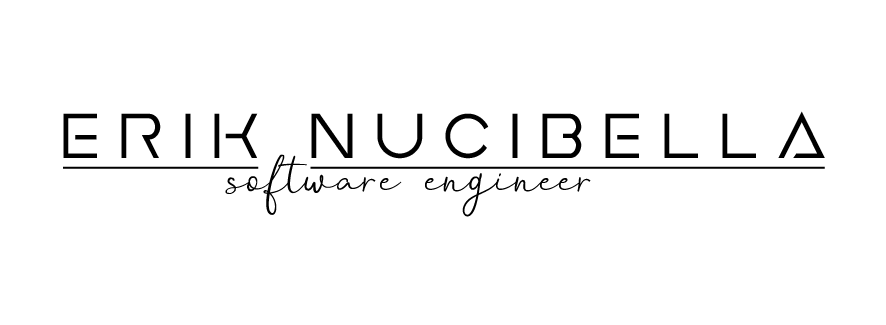

<!--
**akanoce/akanoce** is a ✨ _special_ ✨ repository because its `README.md` (this file) appears on your GitHub profile.

Here are some ideas to get you started:

- 🔭 I’m currently working on ...
- 🌱 I’m currently learning ...
- 👯 I’m looking to collaborate on ...
- 🤔 I’m looking for help with ...
- 💬 Ask me about ...
- 📫 How to reach me: ...
- 😄 Pronouns: ...
- ⚡ Fun fact: ...
-->

  

## Hi there 👋 i'm Erik Nucibella, a Software Engineer specialized in Fullstack Web Development 
### I work as a freelancer often handling projects from the design and implementation to the deploy, but i also integrate in mid-size teams managed by PMs.
### With a strong passion for programming, i exploit the skills acquired over the years to develop my own project and ideas.
### For two years, i've been particularly interested in personal finance and financial markets, digging deep into subjects like investing, trading and risk management. I am therefore skilled and interest in algorithmic trading and quantitative finance, developing and backtesting hundreds of algos, which led to the creation of a web based platform that allow to create and backtest strategies written via a python code-editor, that will be the base of my own robo-advisory service   
